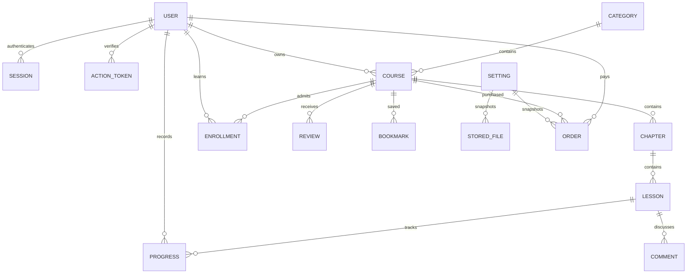

> Cập nhật chính sách HaoBox: theo yêu cầu người dùng, file bài học được chấp nhận bất kể visibility PUBLIC/PRIVATE hoặc không được trả về. Không đưa file vào thùng rác vì visibility. Quyền đọc qua API Wisdom vẫn được kiểm tra. Các ghi chú private guard trong lịch sử bên dưới mô tả hành vi cũ.

# Wisdom rebuild

## Khảo sát 19/09/2026

Chỉ sửa wisdom-api và wisdom-web. Hai repository ban đầu chỉ có README, working tree sạch. Không thấy AGENTS.md trong các đường dẫn dự án và thư mục cha được kiểm tra.

| Phạm vi | Wisdom cũ | Thiết kế mới |
|---|---|---|
| Tài khoản | JWT, refresh, xác minh, hồ sơ; nhiều module | Một API, token refresh xoay vòng, kiểm tra trạng thái tài khoản mỗi request |
| Khóa học | Course phân cấp, draft, duyệt, giá riêng | Course → Chapter → Lesson; DRAFT/PENDING/PUBLISHED/REJECTED/ARCHIVED |
| Học tập | Enrollment, currentMillis, completedCourse | Enrollment duy nhất theo user/course, progress theo lesson |
| Bình luận/đánh giá | Có controller và client API | Kiểm tra quyền học, phản hồi và moderation |
| Bookmark | UserBookmark.jsx chỉ có tiêu đề | Lưu/bỏ lưu và danh sách từ database |
| Thanh toán | Invoice/VNPay và trang return | IPN xác minh chữ ký, giá DB, snapshot cấu hình, khóa giao dịch |
| Cài đặt | Không đáp ứng cấu hình 3 dịch vụ động | ADMIN UI, mã hóa secret, keep/replace/delete, audit |

Tham khảo file-manager: package api/common/controller/request/response, config/domain/repository/security/service; DTO, validation, exception; React Query, Zustand, Axios; bảng, panel trắng, sidebar và palette ink #18251e, moss #176b4c, canvas #f6f8f4, line #e3e9e2, coral #de7654, Manrope. Không sao chép token trong URL của client tham khảo.

## HaoBox: bằng chứng và giới hạn

https://haobox.cloud/developers/docs không đọc được bằng công cụ web. Đối chiếu DeveloperPublicPage, DeveloperController, FileResponse, FileRecord và FileManagerService tại file-manager.

- Bearer API key; POST /api/v1/developer/files, multipart `file`, query `parentId`.
- GET /api/v1/developer/files trả Page<FileResponse>; không có endpoint metadata đơn file trong controller. Dùng phân trang danh sách để tìm metadata.
- GET /api/v1/developer/files/{id}/download hỗ trợ Range/206/Content-Range.
- DELETE /api/v1/developer/files/{id} đưa vào Trash, không xóa vĩnh viễn.
- Scopes: files:read, files:write, files:delete; folders:read/write nếu dùng thư mục.
- FileRecord mặc định PUBLIC; download public không cần khóa khi PUBLIC. Developer API chưa có cập nhật visibility. Vì vậy upload bài học phải từ chối kết quả không PRIVATE và chuyển file đó vào Trash. Cần HaoBox triển khai private mặc định hoặc bổ sung hợp đồng private trước khi nghiệm thu video trả phí. Không dùng public URL hay giả định signed URL.
- API base URL do admin xác nhận/nhập; không coi URL website tài liệu là API base.
- Chưa xác minh deployment thực tế, credentials, quota và private trên haobox.cloud.

VNPay đối chiếu https://sandbox.vnpayment.vn/apis/docs/thanh-toan-pay/pay.html: HMAC-SHA512, canonical query tăng dần, amount ×100, IPN cập nhật, return chỉ hiển thị.

## Kiến trúc và giả định nghiệp vụ

Java 11 / Spring Boot 2.7.18 / JPA / MySQL / Flyway. React TypeScript Vite / Tailwind / Router / Query / Zustand / Axios / RHF / Zod.

ADMIN quản lý cấu hình và quyền; MANAGER duyệt nội dung/danh mục, không đọc secret hoặc cấp ADMIN. INSTRUCTOR chỉ sửa khóa học của mình. STUDENT học, bình luận, đánh giá sau enrollment.

Khóa đã có học viên không xóa vật lý hay sửa cấu trúc/giá; có thể ẩn khỏi catalog bằng ARCHIVED, học viên cũ tiếp tục học. Để thay nội dung cần tạo khóa mới; tránh làm mất nội dung đã mua. Người tạo không tự duyệt khóa của mình.

Settings lưu phiên bản bất biến; file và đơn hàng giữ setting ID cũ. Secret AES-GCM, khóa gốc từ môi trường. Tắt provider hiện hành dừng upload/mua mới; nội dung và đối soát cũ dùng snapshot.

Mô hình: users → sessions/action_tokens; categories → courses(owner) → chapters → lessons; users × courses → enrollments/bookmarks/reviews; users × lessons → progress; comments có parent; settings → files/orders; audit ghi actor/action, không payload secret. FK và unique constraints bảo vệ quan hệ.

## Giai đoạn

1. Khung, migration, auth, quyền, bootstrap admin, layout.
2. Settings UI, SMTP động, HaoBox streaming/private guard.
3. Danh mục, authoring chương/bài, duyệt.
4. Catalog, enroll, học/progress.
5. VNPay/IPN, orders và enrollment.
6. Bình luận, review, bookmark, dashboard; kiểm thử và tài liệu.

Kết quả thực tế và hạng mục chưa hoàn thành được cập nhật trong `progress.md`.
